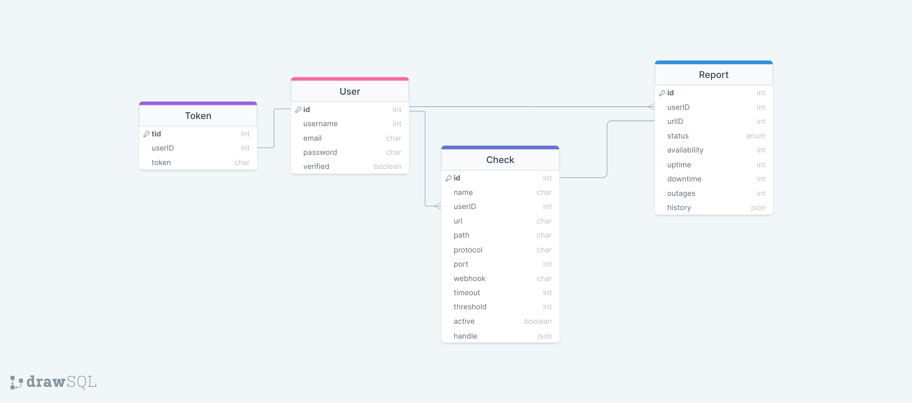

# URL-Monitor
JSON-Based API for monitoring Servers/Other API's States and Responses. Provides a SignUp/SignIn Utility including Email Verification for users. Each URL Monitor provides an Email Notification Service for Live Up-to-date results. Users can get detailed uptime reports about their availability, average response time, and total uptime/downtime.

## Prerequisites

| Binaries | Version          |
| -------- | ---------------- |
| NodeJS   | >= 14.17.6 - LTS |
| NPM      | 8.12..1          |

```sh
# Clone the Repo
git clone git@github.com:Ahmad-Abdalmageed/URL-Monitor.git
cd ./URL-Monitor/

# Install the Dependencies listed in the package.json 
# You could also use npm install
npm install
```

For local testing of the API you'll need to create a `.env` file with the following variables, For Mailing Services you could use Nodemailer Etherial Service. All Requests will use the base URL defined bellow.

```sh
db={Mongo DB Connection Link}
email_host={SMTP Service HOST}
email_user={SMTP Service Email}
email_pass={SMTP Service Password}
email_port={SMTP Service Port}
bcrypt_pass={Password Encryption Seceret}
bcrypt_salt={Password Encryption Seceret Rounds}
token_secret={Authorization Encryption Secret}
port=8000
base_url=http://localhost:8000/api/v1
node_env=dev
```

To start Local Server hit `npm run start` in terminal, also provided a `Nodemon`watcher for development using `npm run watch`.


## Authentication

User Authentication start with a Request for `{base_url}/users/signup` with the following description. Email, Username and Password is sent in the body of the request.

```
POST http://localhost:8000/api/v1/users/signup/
Content-Type: application/json
Accept: */*
 
{
"username": {username},
"email": {email},
"password": {password}
}
```

On Successful Invoke the API Responds with the Verification link and the newly created user entry.

## Authorization

In order to use the API's Resources the user will sign in following the `{base_url}/users/login/` request with the following description. Only Email and Password is sent.

```
GET http://localhost:8000/api/v1/users/login/
Content-Type: application/json
 
{
"email": "miveson0@scribd.com",
"password": "ghlGg8l"
}
 
```

On Successful Invoke the API Responds with the User Specified token that will be used through out the API.

## URL Check Monitoring

Each URL Check Contains the following parameters, Creating each check does not require providing all the requirements bellow, by providing only the `name` and `url`the check can be created.
  - `name`: The name of the check.
  - `url`: The URL to be monitored.
  - `protocol`: The resource protocol name `HTTP`, `HTTPS`, or `TCP`.
  - `path`: A specific path to be monitored *(optional)*.
  - `port`: The server port number *(optional)*.
  - `webhook`: A webhook URL to receive a notification on *(optional)*.
  - `timeout` *(defaults to 5 seconds)*: The timeout of the polling request *(optional)*.
  - `interval` *(defaults to 10 minutes)*: The time interval for polling requests *(optional)*.
  - `threshold` *(defaults to 1 failure)*: The threshold of failed requests that will create an alert *(optional)*.
  - `authentication`: An HTTP authentication header, with the Basic scheme, to be sent with the polling request *(optional)*.
    - `authentication.username`
    - `authentication.password`
  - `httpHeaders`: A list of key/value pairs custom HTTP headers to be sent with the polling request (optional).
  - `assert`: The response assertion to be used on the polling response (optional).
    - `assert.statusCode`: An HTTP status code to be asserted.
  - `tags`: A list of the check tags (optional).

```
POST http://localhost:8000/api/v1/checks/
Authorization: Bearer {token}
Content-Type: application/json
 
{
"name": "Quo Lux",
"url": "http://dummyimage.com/"
}
 
```

By providing the Token of the Authorized User The API Creates the URL Check with only the name and url provided. Immediate Report Gets Created for the added Check with the following Parameters :

  - `status`: The current status of the URL.
  - `availability`: A percentage of the URL availability.
  - `outages`: The total number of URL downtimes.
  - `downtime`: The total time, in seconds, of the URL downtime.
  - `uptime`: The total time, in seconds, of the URL uptime.
  - `responseTime`: The average response time for the URL.
  - `history`: Timestamped logs of the polling requests.

#### Available CRUD Endpoints

- `CREATE`: `POST /api/v1/checks/ `
- `READ` with name: `GET /api/v1/checks/{url-encoded Check Name} `
- `READ`All User Checks `GET /api/v1/checks/`
- `Update`: `Patch /api/v1/checks/{checkID}  `
- `Delete`: `DELETE /api/v1/checks/{checkID}`

## Report

Each URL Created Immediately fires an Event "Check Created" which then triggers a Polling Function with a timer that executes on intervals defined by the user and updates the report to be ready to use by the user. 

```
GET /api/v1/reports/{checkID} HTTP/1.1
Authorization: Bearer {token}
```

The above request results in reporting the Monitored link given with the`checkID` the report paramaters defined above

```json
{
    "message": "Reports Found",
    "userReport": [
        {
            "_id": "634c7ed7d02c6c412136d92d",
            "urlID": "634c7ed7d02c6c412136d92a",
            "userID": "634c7a3edcded3177474e142",
            "status": "available",
            "availability": 70,
            "outages": 0,
            "downtime": 5002,
            "uptime": 12146,
            "responseTime": 454,
            "history": [
                {
                    "timestamp": "2022-10-16T21:47:35.431Z",
                    "status": "available",
                    "availability": 0,
                    "_id": "634c7f15d02c6c412136d9c1"
                }
            ]
        }
    ]
}


```


## Database Entities



